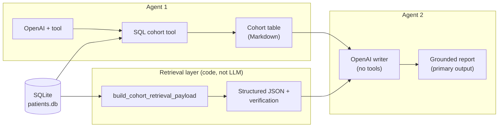

# High-Risk Patient Identifier (HW3)

**Disclaimer.** This project uses **synthetic / educational** SQLite data and **heuristic** quality metrics. Outputs are **not** clinically validated. Do **not** use for diagnosis, treatment, regulatory submissions, or real patient decisions.

---

## Table of contents

1. [What the pipeline actually does](#what-the-pipeline-actually-does)
2. [Agentic loop (two agents + retrieval)](#agentic-loop-two-agents--retrieval)
3. [Shiny app: what you see](#shiny-app-what-you-see)
4. [Quality control: two prompts & metrics](#quality-control-two-prompts--metrics)
5. [Technical details](#technical-details)
6. [Usage](#usage)
7. [Artifacts](#artifacts)
8. [Troubleshooting](#troubleshooting)

---

## What the pipeline actually does

Verified against **`clinical_pipeline.run_full_homework2_pipeline`** (no code changes here—this is documentation only):

| Step | What runs | Notes |
|------|-----------|--------|
| **1. Agent 1** | OpenAI Chat Completions with a **forced tool** | Must call **`list_phq9_elevated_with_safety_concerns`**, which runs SQL on **`patients.db`** for visits with **PHQ-9 > 15** (**≥ 16**) and **`safety_concerns = Y`**. Output is the cohort dataframe. |
| **2. Retrieval (“RAG” context)** | **Deterministic code** — [`retrieval.build_cohort_retrieval_payload`](retrieval.py) | Not an LLM. Builds **`retrieval_payload.json`** (e.g. provider stats, meds, lapsed follow-up) from the DB + cohort patient IDs; writes **verification JSON/MD**. This is the **retrieval-augmented** structured context layered on top of the tool output. |
| **3. Agent 2** | OpenAI **`agent_run`** with **tools disabled** | A single reporting model receives **the same bundled inputs**: cohort table Markdown, retrieval JSON as text, **`clinical_rag_rules.yaml`**, and verification wording. Conceptually **one writer** consumes **Agent 1’s table + retrieval payload**. |

**Evaluation hook:** for each **`trial_id`**, the orchestrator calls **Agent 2 twice in a row**: first filling the **baseline** template ([`qc/prompts/hw2_baseline_prompt.txt`](qc/prompts/hw2_baseline_prompt.txt)), second the **grounded executive** template ([`qc/prompts/hw2_grounded_prompt.txt`](qc/prompts/hw2_grounded_prompt.txt)). Both strings are validated and logged to **`qc_results.csv`**. The **_return value used as the primary report / `report_full` is always the grounded (second) output** (`clinical_pipeline.py` sets `report_full` from **`report_b_latest`**).

---

## Agentic loop (two agents + retrieval)

This diagram matches **how context flows into the grounded clinical narrative** Agent 2 produces. Retrieval is modeled as **RAG-style augmentation**—structured facts fetched and formatted for the writer—not a separate chat model.



Same pipeline call **also** generates the looser baseline report for QC (same Agent 2 model path, alternate prompt template). That comparison layer is **[documented below](#quality-control-two-prompts--metrics)** and does **not** change the conceptual **two-agent** design of the clinical path.

---

## Shiny app: what you see

[`app/app.py`](app/app.py) loads the pipeline once you run analysis and sets **`report_md`** from **`result["report_full"]`**, which is the **grounded** report only—the **clinical summary accordion does not surface the baseline prompt as the main narrative**.

| UI area | Behavior |
|---------|----------|
| **Clinical summary** | Markdown for the **grounded executive** prompt. |
| **Live quality** ([`live_validation_card.py`](app/live_validation_card.py)) | After a run, **validators + weighted score + pass flag** apply to **that grounded text** only (wrong section headings, grounding checks, lightweight panel). |
| **Quality checks accordion** | Shows **paired statistics** once **`out/qc_results.csv`** exists: baseline vs grounded rows from the **same orchestrated run**, including pass rates, Wilson/bootstrap/McNemar summaries when **`qc_summary`** is available (`_qc_dashboard_html`). |

---

## Quality control: two prompts & metrics

This block is **separate** from the product agent diagram above: purpose is **measurement**.

- **Prompt A (baseline)** — qualitative, fewer mandated sections (`hw2_baseline_prompt.txt`).
- **Prompt B (grounded)** — strict counts, headings, disclosures (`hw2_grounded_prompt.txt`).

For each **`trial_id`**, both completions are graded with mode-specific heading lists (`section_headers_for_mode` in [`qc/validators.py`](qc/validators.py)). Results land in **`out/qc_results.csv`** (one row per **mode** × **`trial_id`**) and narrative + tables in **`out/qc_summary.md`** via [`qc/statistical_analysis.py`](qc/statistical_analysis.py) + [`qc/report_generation.py`](qc/report_generation.py).

**CSV mode keys:** `baseline` (= Prompt A) · `grounded` (= Prompt B).

---

### 1. What we measured — outcome variables

Every validated report gets at least:

| Output | Meaning | Where |
|--------|---------|--------|
| **`validity_score_0_100`** | Weighted rollup of dimensional rates (**0–100**), minus a capped hallucination-style penalty | `qc_results.csv`, `qc_summary.md` |
| **`passed_absolute_validity`** | **Boolean** conservative pass gate independent of pairwise stats | same |
| **`numeric_accuracy_rate`** · **`numeric_accuracy_score`** | Blend of cohort count echoes + provider linkage (alias pair for reporting) | `qc_results.csv` |
| **`required_sections_rate`** | Fraction of required `##` headings present for **that prompt mode** | same |
| **Per‑count fidelity** (`visit_*`, `patient_*`, `lapsed_*`) | **0–1** match signals for totals vs deterministic ground truth | same |
| **Disclosure / content rates** (`retrieval_check_disclosure_rate`, `limitation_disclosure_rate`, `medication_theme_mention_rate`) | **0–1** or tiered (**0 / 0.5 / 1**) heuristics | same |
| **Hallucination proxies** (`clinically_unsupported_number_count`, `unsupported_patient_identifier_count`, `unsupported_provider_count`) | Integer counts surfaced for debugging / penalties | same |

Implementations live in [`qc/validators.py`](qc/validators.py) (**metrics**) and [`qc/scoring.py`](qc/scoring.py) (**rollup + strict pass**).

---

### 2. Weight chart — scoring components ([`qc/scoring.py`](qc/scoring.py) **`WEIGHTS`**)

Rates below are clipped to **[0, 1]** before weighting. A small **concision** term adds up to **5** points (`concision_norm` defaulted to **0.65×5 ≈ 3.25** when no human concision rating is supplied). **Hallucination penalty** subtracts up to **35** from the weighted sum (`10×unsupported_numerals + 12×bad_patient_ids + 6×bad_providers`, capped).

| Metric (CSV) | Meaning (short) | Weight (points × rate) |
|----------------|----------------|------------------------|
| **`numeric_accuracy_rate`** | Composite visit / patient / lapsed fidelity + provider visit linkage | **34** |
| **`patient_count_match_rate`** | Distinct patient total echoed correctly vs cohort | **10** |
| **`provider_count_match_rate`** | Each canonical provider cites correct visit integer from retrieval JSON | **11** |
| **`lapsed_followup_match_rate`** | Lapsed follow-up row-count echoed correctly | **9** |
| **`required_sections_rate`** | Required Markdown headings for **baseline vs grounded** mode | **12** |
| **`retrieval_check_disclosure_rate`** | Mentions retrieval / verification / data reliability cues | **8** |
| **`limitation_disclosure_rate`** | Limitations heading + synthetic/audit language | **8** |
| **`medication_theme_mention_rate`** | Top retrieval medication strings echoed in prose | **8** |
| Concision multiplier | Bounded **5 ×** normalized aux score (**1–5** Likert pathway; usually fixed neutral) | **up to +5** |

**Strict pass thresholds** (**all must hold**, from [`qc/scoring.py`](qc/scoring.py)):

| Requirement | Threshold |
|-------------|-----------|
| **`validity_score_0_100`** | ≥ **80** |
| **`required_sections_rate`** | **1.0** |
| **`patient_count_match_rate`**, **`visit_count_match_rate`**, **`lapsed_followup_match_rate`** | Each **1.0** |
| **`unsupported_patient_identifier_count`** | **0** |
| **`unsupported_provider_count`** | **0** |
| **`clinically_unsupported_number_count`** | **0** |

---

### 3. Automated validation checklist (**what each check does ↔ column**)

Validators compare report text against a deterministic **ground-truth snapshot** from the cohort dataframe + **`retrieval_payload`** + verification JSON (**`extract_hw2_ground_truth`**).

| Check | Measurement | CSV column(s) |
|-------|--------------|---------------|
| **Required sections** | Fraction of mandated `##` headers for **baseline** (3) vs **grounded** (7) | `required_sections_rate` |
| **Visit total echo** | Labeled phrases / weak echo vs cohort row count `n_visits` | `visit_count_match`, `visit_count_match_rate` |
| **Patient total echo** vs distinct **`patient_id`** | same | `patient_count_match`, `patient_count_match_rate` |
| **Lapsed follow‑up echo** vs retrieval slice count | same | `lapsed_followup_match`, `lapsed_followup_match_rate` |
| **Provider linkage** | For each retrieval provider × visit total, prose cites name + matching integer | `provider_count_match_rate` |
| **Composite numeric strand** | Weighted aggregate of echoes + providers | `numeric_accuracy_rate`, `numeric_accuracy_score` |
| **Retrieval QC narrative** | Text references verification failures/passes appropriately | `retrieval_check_disclosure_rate` |
| **Limitations & audit wording** | Section + educational/synthetic cues | `limitation_disclosure_rate` |
| **Medication themes** | Hit rate on payload “top meds” snippets | `medication_theme_mention_rate` |
| **Extra clinically loaded integers** | Digits allowed only if drawn from enumerated safe set (+ regex context filters) | `clinically_unsupported_number_count` (+ JSON debug columns when present) |
| **Patient ID mentions outside cohort** | Parsed patient-style IDs **not** in deterministic cohort ID set | `unsupported_patient_identifier_count` |
| **Provider mentions off canonical roster** | **`Dr.`‑style strings** misaligned vs retrieval/cohort provider names | `unsupported_provider_count` |
| **Score + gate** | Penalty-adjusted rollup + **`passed_absolute_validity`** | `validity_score_0_100`, `passed_absolute_validity` |

Row-level mismatches sometimes appear in **`numeric_mismatch_flags`** (JSON) and analogous debug cells.

---

### 3b. Master criteria table (dimensions → scale → benchmark)

| Dimension | Description | Scale / method | Benchmark (strict pass) |
|-----------|-------------|----------------|-------------------------|
| **Composite numeric alignment** | Weighted blend of visit / patient / lapsed echoes + provider visit linkage vs ground truth | Rate **0–1** → contributes **34** pts to score | Indirect: drives **`validity_score_0_100`** toward **≥80** with other parts |
| **Visit count fidelity** | Reported total visits vs cohort SQL row count | **0–1** (partial if “weak” unlabeled echo) | **1.0** required |
| **Patient count fidelity** | Distinct patient total vs cohort | **0–1** | **1.0** required |
| **Lapsed follow-up fidelity** | Lapsed row count vs retrieval payload | **0–1** | **1.0** required |
| **Provider linkage** | Each canonical provider's visit total appears next to that name in prose | **0–1** coverage | Contributes via composite weight **11** |
| **Required sections** | Mandated `##` headers for **Prompt A** (3) or **Prompt B** (7) | **0–1** fraction | **1.0** required |
| **Retrieval / QC disclosure** | Narrative touches verification / reliability | **0**, **0.5**, or **1.0** heuristic | Rewarded (**8** pts weight) |
| **Limitations & audit wording** | Limitations block + synthetic/educational cue | **0–1** blend | Rewarded (**8** pts weight) |
| **Medication theme coverage** | Mentions retrieval “top meds” snippets | **0–1** | Rewarded (**8** pts weight) |
| **Clinically unsupported numerals** | Integers outside allowed deterministic set in clinical-like contexts | Non‑negative integer count | **0** occurrences required |
| **Unsupported patient identifiers** | `patient id` parses not in cohort | Count | **0** required |
| **Unsupported providers** | Off-roster **`Dr.`** patterns | Count (capped in export) | **0** required |
| **Weighted validity score** | Sum of weighted rates + concision − capped penalty ([`qc/scoring.py`](qc/scoring.py)) | **0–100** continuous | **≥ 80** for strict pass |
| **Absolute validity** | Consolidated gate on score + fidelity + hallucination proxies | Boolean | See §2 checklist |

---

### 4. Statistical tests — what runs on **`qc_results.csv`**

All of the following aggregate **paired** **`trial_id`** rows when **both** `baseline` and `grounded` exist. Details and formatted strings are emitted to **`qc_summary.md`**.

| Test / summary | Hypothesis role (conceptual) | Implementation notes (`qc/statistical_analysis.py`) |
|----------------|------------------------------|-----------------------------------------------------|
| **Mean validity ± naive 95 % CI** | Baseline dispersion on **0–100** score across rows | Gaussian-style interval on pooled means |
| **Wilson score interval per mode** pass rate | Confidence on strict-pass **proportion** (better than Normal approx. for tiny *n*) | `_wilson_ci` |
| **Bootstrap CI on pass‑rate Δ** (grounded − baseline) | Uncertainty around improvement in **`passed_absolute_validity`** | Paired-resample (**8000** draws, seeded) |
| **McNemar paired binary test** | **H₀:** no systematic shift in strict pass between paired responses | `statsmodels` exact table when installed; fallback **exact binomial two-sided** on discordant counts |
| **Paired _t_-style statistic on validity gap** (_grounded_ − _baseline_) | Mean shift in continuous score | `_paired_ttest` on paired score lists (**returns `None`** if *&lt;2* pairs). |
| **Cohen’s _d_ (paired‑style helper)** | Standardized magnitude of mean score gap vs pooled dispersion heuristic | Listed alongside comparative block |
| **Failure-mode frequency table** | Which validator-adjacent flags fire most among rows (**non‑exclusive**) | Derived masks (numeric drift, headings, hallucination‑proxy columns, compatibility grader stubs) stitched into **`qc_summary.md`** |
| **Confidence × validity correlation** _(optional)_ | Calibration narrative when score variance exists | Pearson _r_; often **skipped** HW2 payloads mark confidence **neutral**. |

Typical directional **research expectation**: for the **same** cohort bundle, **`grounded`** should outperform **`baseline`** on **`validity_score_0_100`** and **`passed_absolute_validity`**, but empirical results depend on model, RNG seeds, **`n_trials`**, etc.

<details>
<summary>Full prompt texts (baseline + grounded)</summary>

See [`qc/prompts/hw2_baseline_prompt.txt`](qc/prompts/hw2_baseline_prompt.txt) and [`qc/prompts/hw2_grounded_prompt.txt`](qc/prompts/hw2_grounded_prompt.txt). Placeholders **`<<<COHORT_TABLE>>>`**, **`<<<RETRIEVAL_JSON>>>`**, **`<<<RULES_BLOCK>>>`**, etc. are filled in [`clinical_pipeline.py`](clinical_pipeline.py).

</details>

---

## Technical details

| Variable | Role |
|----------|------|
| **`OPENAI_API_KEY`** | Required for Agents 1 and 2 (`functions.py`). Repo-root **`.env`** or **`HW2/.env`** via [`dotenv_loader.py`](dotenv_loader.py). |
| **`OPENAI_MODEL`** | Optional model override |
| **`PATIENTS_DB`** | Optional SQLite path override |
| **`HW2_QC_TRIALS`** / **`HW2_QC_TRIALS_APP`** | Repeated paired baseline+grounded batches |

**Deps:** **`requirements.txt`**. Published app: **`PUBLISH_CONNECT.md`**.

### Main modules

| File | Responsibility |
|------|------------------|
| [`clinical_pipeline.py`](clinical_pipeline.py) | Pipeline entry, retrieval I/O, dual report calls + QC aggregation |
| [`functions.py`](functions.py) | `agent` / `agent_run`, OpenAI |
| [`retrieval.py`](retrieval.py) | Cohort-linked retrieval payload + verification helpers |
| [`app/app.py`](app/app.py) | Shiny UX, grounded-first display, QC panels |
| [`app/live_validation_card.py`](app/live_validation_card.py) | Live validators UI for grounded text |
| [`qc/*.py`](qc/) | validators, scoring, stats, summaries, experiments |

---

## Usage

```bash
# repo root
cp .env.example .env    # then set OPENAI_API_KEY

cd HW2
python3.12 -m venv .venv && source .venv/bin/activate
pip install -r requirements.txt

# UI
shiny run app/app.py --reload

# CLI full pipeline (respects HW2_QC_TRIALS env)
python clinical_pipeline.py

# Multi-trial experiment
python qc/run_hw2_qc_experiment.py --n-trials 20

# Re-score saved CSV — no LLM calls
python qc/run_hw2_qc_experiment.py --regrade-existing
# or  python qc/regrade_hw2_qc.py
```

---

## Artifacts

| Path | Meaning |
|------|---------|
| `out/agent1_tool_trace.json` / `agent1_cohort_findings.md` | Agent 1 trace + cohort markdown |
| `out/retrieval_payload.json`, `retrieval_verification.*` | Retrieval + checks |
| `out/prompt_a_baseline_report.md` | Latest baseline QC report |
| `out/prompt_b_grounded_report.md`, `homework2_comprehensive_report.md` | **Primary** grounded report(s) |
| `out/qc_results.csv`, `out/qc_summary.md` | Paired QC metrics & write-up |

**Tool:** **`list_phq9_elevated_with_safety_concerns`** — SQL definition in **[`clinical_pipeline.py`](clinical_pipeline.py)**.

---

## Troubleshooting

| Issue | Hint |
|-------|------|
| Agent 1 missing tool output | Confirm API key & **tool-capable** model (`gpt-4o-mini`, etc.) |
| Empty cohort | Check **`patients.db`** location / schema |
| QC stats noisy | Increase **`--n-trials`** |
| Deploy to Connect | **`PUBLISH_CONNECT.md`** |

**Quick refs:** primary UI report = **`grounded`** (`report_full`) · `python qc/run_hw2_qc_experiment.py --help`
