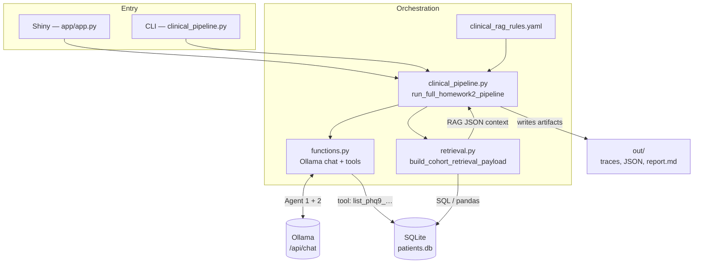

# High-Risk Patient Identifier

## 📌 Overview

This package runs a **two-stage LLM workflow** over a local SQLite database ([`patients.db`](patients.db)) in this directory:

1. **Agent 1 (function calling)** — The model must invoke a registered tool named **`list_phq9_elevated_with_safety_concerns`**, which executes fixed SQL against [`patients.db`](patients.db) and returns a DataFrame of visits where **PHQ-9 &gt; 15** and **`safety_concerns` is Yes**. That table is the cohort.

2. **Retrieval (RAG context)** — Python builds a **structured retrieval payload** (JSON) via [`retrieval.py`](retrieval.py): cohort-scoped SQL + pandas for provider concentration, medication strings, lapsed follow-up, etc. This is the **“R” in RAG**—deterministic context assembled from the database **before** the second generation step.

3. **Agent 2 (RAG generation)** — The second call receives the cohort table (Markdown) and the retrieval JSON embedded in the user message and writes a **clinical Markdown report** grounded in that context only—**retrieve → augment prompt → generate**, i.e. a **RAG-style** call, with retrieval implemented as SQL/JSON rather than a vector index.

### System architecture



**Primary way to run:** the **Shiny for Python** dashboard in [`app/app.py`](app/app.py). It calls [`clinical_pipeline.py`](clinical_pipeline.py) (`run_full_homework2_pipeline`) to execute the same steps and refreshes files under [`out/`](out/). For a non-UI run, use `python clinical_pipeline.py` from this folder (optional).

### Self-contained `HW2/` package

- **All runtime Python for this assignment lives in `HW2/`** — [`clinical_pipeline.py`](clinical_pipeline.py), [`functions.py`](functions.py), [`retrieval.py`](retrieval.py), [`app/app.py`](app/app.py), etc. You can copy or clone **only** the `HW2` directory, create a venv, install [`requirements.txt`](requirements.txt), add [`patients.db`](patients.db), and run.
- **Data file:** [`patients.db`](patients.db) is expected next to this README unless you set **`PATIENTS_DB`** to an absolute path. If the DB is not in git, place a compatible `patients.db` here after clone (the install steps show one way to obtain it from elsewhere in the repo).
- **Generated outputs:** [`out/`](out/) is created when you run the app or CLI. Those files are **artifacts**, not source; add `out/` to `.gitignore` if you do not want run outputs in version control.
- **Not bundled in git:** **[Ollama](https://ollama.com)** and a pulled chat model (default **`llama3.2`**) — install locally, same as any other machine learning service.

---

## ✨ Features

- **Tool:** `list_phq9_elevated_with_safety_concerns` — cohort query tool; Ollama dispatch in [`functions.py`](functions.py); tool definition and orchestration in [`clinical_pipeline.py`](clinical_pipeline.py).
- **RAG pipeline:** Cohort patient IDs → `build_cohort_retrieval_payload` → `retrieval_payload.json` → second prompt → narrative report.
- **Verification files:** Tool trace, retrieval checks, and final report under [`out/`](out/) (see below).
- **Dashboard:** [`app/app.py`](app/app.py) — cohort filters, report view, and one-button pipeline run.

---

## Agent 1 tool: `list_phq9_elevated_with_safety_concerns`

This is the **only registered function-calling tool** for Agent 1. The model is expected to invoke it (native `tool_calls` or equivalent) so cohort selection is **grounded in SQL**, not free-form reasoning.

### What it does

| Aspect | Detail |
|--------|--------|
| **Purpose** | Return one row per **visit** in [`patients.db`](patients.db) where **PHQ-9 &gt; 15** (scores 16+) **and** `safety_concerns` is **Yes** (`Y` after trim/uppercase). |
| **Definition** | Tool schema and handler live in [`clinical_pipeline.py`](clinical_pipeline.py) (`tool_list_phq9_safety`, function `list_phq9_elevated_with_safety_concerns`). Execution and Ollama round-trips are in [`functions.py`](functions.py). |
| **Arguments** | Empty object `{}` — the implementation **always** reads [`patients.db`](patients.db) (or `PATIENTS_DB` if set); the model cannot point the tool at another path. |
| **Query shape** | `visits` joined to `patients`, filtered and ordered by visit date (newest first). |

**Columns in the tool result (per visit):** `patient_id`, `patient_name`, `date_of_birth`, `visit_id`, `visit_date`, `phq9_score`, `safety_concerns`, `diagnosis`, `provider`, `medications`.

That table is the **cohort** for the rest of the pipeline: retrieval scopes to those patient/visit IDs, and Agent 2 sees the cohort (as Markdown) plus the retrieval JSON.

### Where the tool’s outputs show up

| Output | What it contains |
|--------|------------------|
| **In-memory** | A **pandas `DataFrame`** returned from `list_phq9_elevated_with_safety_concerns` and threaded through [`clinical_pipeline.py`](clinical_pipeline.py) as the cohort. |
| [`out/agent1_tool_trace.json`](out/agent1_tool_trace.json) | **Audit trail** for Agent 1: whether `tool_calls` named **`list_phq9_elevated_with_safety_concerns`**, and a **summary** of the tool result (row/column counts). |
| [`out/agent1_cohort_findings.md`](out/agent1_cohort_findings.md) | **Human-readable** run log: verification that the correct tool ran, plus the **full cohort table** (Markdown) produced from the DataFrame. |
| Downstream | Cohort IDs drive [`out/retrieval_payload.json`](out/retrieval_payload.json) and the Agent 2 prompt; the final narrative is [`out/homework2_comprehensive_report.md`](out/homework2_comprehensive_report.md). |

---

## ⚙️ Requirements

| Need | Purpose |
|------|---------|
| **Python 3.10+** | Scripts and Shiny UI |
| **[Ollama](https://ollama.com)** | Local LLM API (default **`llama3.2`**) |
| **[`patients.db`](patients.db)** | SQLite DB in this folder (`HW2/patients.db`), or override with `PATIENTS_DB` (absolute path) |

Database resolution: [`clinical_pipeline.py`](clinical_pipeline.py) sets `DB_PATH` to `PATIENTS_DB` if set, otherwise `HW2/patients.db`.

---

## 📦 Installation

From the **`HW2`** directory:

**1.** Ensure [`patients.db`](patients.db) is present (same folder as this README). If missing, from the repo root: `HW2/patients.db`.

**2.** Pull the default model (macOS / Linux):

```bash
chmod +x setup_hw2.sh
./setup_hw2.sh
```

Or manually / Windows:

```powershell
ollama pull llama3.2
```

**3.** Virtual environment:

```bash
python3 -m venv .venv
source .venv/bin/activate   # Windows: .\.venv\Scripts\Activate.ps1
pip install -r requirements.txt
```

---

## 🚀 Usage

Activate the venv, `cd` to **`HW2`**, ensure Ollama is running, then:

**Shiny app (recommended):**

```bash
shiny run app/app.py --reload
```

Open the URL Shiny prints (usually `http://127.0.0.1:8000`). Use **Generate clinical summary** to run the full pipeline. Artifacts are written to [`out/`](out/).

**CLI (same pipeline, no browser):**

```bash
python clinical_pipeline.py
```

First run may take several minutes while the model loads.

### Environment variables

| Variable | Description |
|----------|-------------|
| `OLLAMA_MODEL` | Model tag (default `llama3.2`; see [`functions.py`](functions.py)) |
| `OLLAMA_HOST` | Base URL (default `http://127.0.0.1:11434`) |
| `PATIENTS_DB` | Absolute path to an alternate SQLite file |

---

## 📁 Project structure

| Path | Role |
|------|------|
| [`README.md`](README.md) | This file — setup, self-contained layout, usage. |
| [`patients.db`](patients.db) | SQLite database read by the tool and by [`retrieval.py`](retrieval.py). |
| [`clinical_pipeline.py`](clinical_pipeline.py) | Tool definition, Agent 1 + Agent 2 orchestration, retrieval payload and verification writes, `out/*`. |
| [`functions.py`](functions.py) | Ollama `/api/chat`, tool execution, helpers (`agent`, `agent_run`, `df_as_text`). |
| [`retrieval.py`](retrieval.py) | **RAG retrieval layer:** SQL/pandas → JSON payload for Agent 2. |
| [`clinical_rag_rules.yaml`](clinical_rag_rules.yaml) | Rules merged into Agent 2 system text via `load_rules()`. |
| [`requirements.txt`](requirements.txt) | Dependencies. |
| [`setup_hw2.sh`](setup_hw2.sh) | Pulls default Ollama model. |
| [`app/app.py`](app/app.py) | Shiny dashboard (imports `clinical_pipeline`). |
| [`app/www/clinical.css`](app/www/clinical.css) | UI stylesheet. |
| [`build_submission_pdf.py`](build_submission_pdf.py) | Optional PDF bundling (requires `reportlab`). |
| [`out/`](out/) | **Generated** at run time (traces, retrieval JSON/MD, final report). Safe to omit from git if you only need source. |

**Minimal set to run after clone:** [`requirements.txt`](requirements.txt) + the Python/YAML/CSS files above + [`patients.db`](patients.db) (or `PATIENTS_DB`) + Ollama with the model pulled.

**Flow:**

```text
patients.db
    → Agent 1 + tool list_phq9_elevated_with_safety_concerns → cohort DataFrame
    → retrieval.py → retrieval_payload.json (RAG context)
    → Agent 2 (prompt + retrieved JSON + table) → homework2_comprehensive_report.md
```

---

## 📊 Output (`out/`) — verification and validation

These files support **auditing** function calling, **RAG payload** consistency, and **grounded** report text.

| File | Purpose |
|------|---------|
| [`out/agent1_tool_trace.json`](out/agent1_tool_trace.json) | **Tool invocation:** native `tool_calls` vs content recovery, and a summary of tool output shape (rows/columns). Confirms Agent 1 used **`list_phq9_elevated_with_safety_concerns`**. |
| [`out/agent1_cohort_findings.md`](out/agent1_cohort_findings.md) | Human-readable cohort log, function-calling verification section, full tool output table. |
| [`out/retrieval_payload.json`](out/retrieval_payload.json) | **Retrieved context** (RAG) passed into Agent 2; numbers come from Python/SQL, not from free-form model reasoning. |
| [`out/retrieval_verification.json`](out/retrieval_verification.json) | Structured pass/fail checks (cohort IDs, visit totals, internal counts). |
| [`out/retrieval_verification.md`](out/retrieval_verification.md) | Same checks in a readable table. |
| [`out/homework2_comprehensive_report.md`](out/homework2_comprehensive_report.md) | Agent 2 narrative; should align with cohort counts and [`retrieval_payload.json`](out/retrieval_payload.json). |

**Suggested audit order:** `agent1_tool_trace.json` → `retrieval_verification.md` → `homework2_comprehensive_report.md`.

---

## 🔧 Troubleshooting

| Issue | Action |
|-------------|--------|
| Connection refused | Start Ollama; check `curl -s http://127.0.0.1:11434/api/tags` |
| Model missing | `./setup_hw2.sh` or `ollama pull llama3.2` |
| Missing / wrong DB | Ensure [`patients.db`](patients.db) in `HW2/` or set `PATIENTS_DB` |
| `no such table: visits` | Incompatible or empty SQLite file |
| Agent 1 no DataFrame | Use a tool-capable model (e.g. `llama3.2`); update Ollama |

---

## 📌 Quick reference

- **Self-contained:** All HW2 source in this folder; no imports from other course directories at runtime.
- **Tool:** **`list_phq9_elevated_with_safety_concerns`**
- **RAG:** Retrieval JSON from [`retrieval.py`](retrieval.py) → Agent 2 prompt → report
- **App:** `shiny run app/app.py --reload`
- **CLI:** `python clinical_pipeline.py`
- **Pipeline module:** [`clinical_pipeline.py`](clinical_pipeline.py) (`run_full_homework2_pipeline`)
- **Audit / artifacts:** [`out/`](out/) (regenerated each run)
