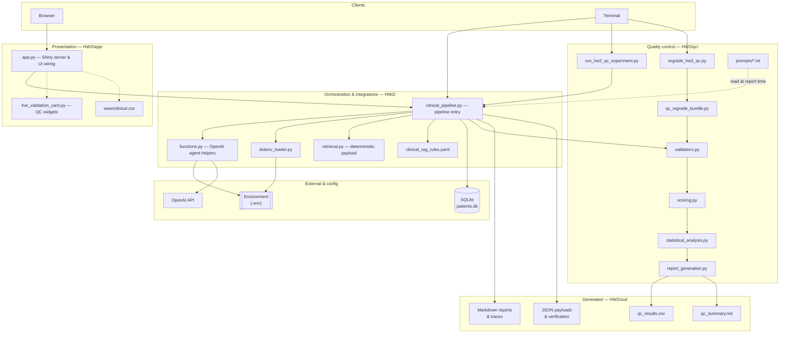
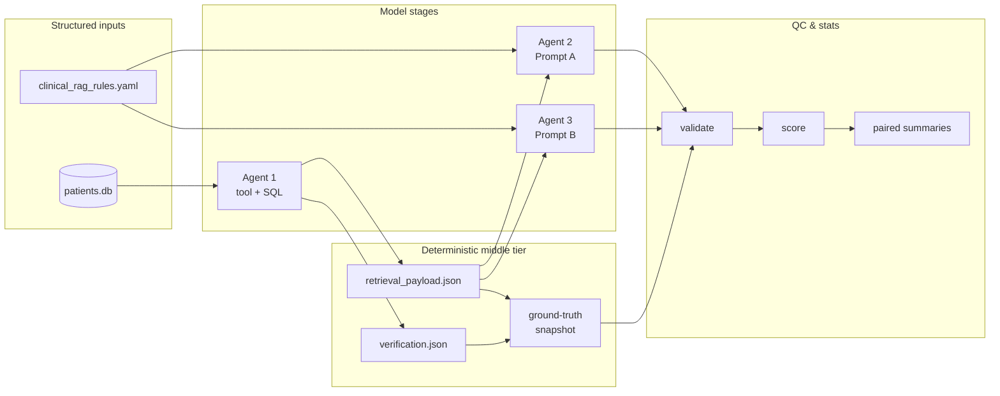
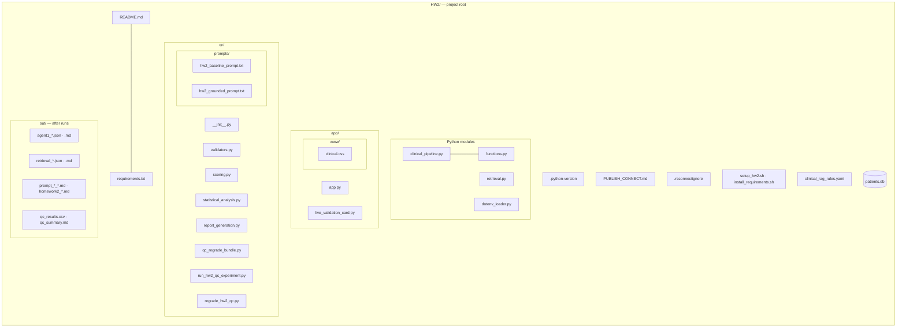
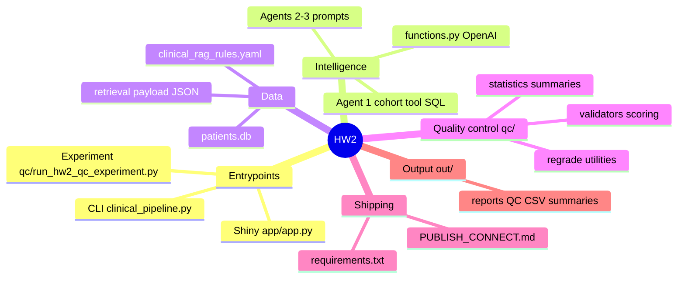
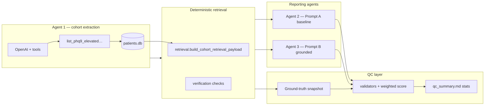

# High-Risk Patient Identifier (HW3)

**Disclaimer.** This project uses **synthetic / educational** SQLite data and **heuristic** quality metrics. Outputs are **not** clinically validated. Do **not** use for diagnosis, treatment, regulatory submissions, or real patient decisions.

---

## Table of contents

1. [App overview](#app-overview)
2. [Architecture & repository diagrams](#architecture--repository-diagrams)
3. [Multi-agent orchestration](#multi-agent-orchestration)
4. [Validation criteria](#validation-criteria)
5. [Experimental design](#experimental-design)
6. [Quality control](#quality-control)
7. [Statistical analysis](#statistical-analysis)
8. [Technical details](#technical-details)
9. [Usage instructions](#usage-instructions)
10. [Artifacts & outputs](#artifacts--outputs)
11. [Troubleshooting](#troubleshooting)

---

## App overview

The **High-Risk Patient Identifier** is an educational analytics app built around a **SQLite** cohort (`patients.db`). It identifies visits that meet a fixed clinical rule (elevated PHQ-9 screening with documented safety concerns), summarizes that cohort together with deterministic retrieval aggregates, and helps you **compare two report-generation strategies** side by side.

**What you interact with**

- **`app/app.py` (Shiny)** — Runs the pipeline, renders the primary **clinical summary** from the grounded report, exposes **QC summaries** when results exist under `out/`.
- **`clinical_pipeline.py` (CLI)** — Same end-to-end flow without the UI: writes Markdown reports, CSV metrics, and summary markdown under **`out/`**.

The system is designed so every narrative is traceable to **structured inputs**: the cohort table, the retrieval JSON, verification flags, and optional policy YAML. A **validation layer** scores how well each generated report stays aligned with those inputs.

---

## Architecture & repository diagrams

### Layered system architecture

High-level components, dependencies, and where artifacts land. Arrows show the main call / data direction.



### Data & control pipeline (concise)



### Repository map (major paths)

Graphical index of the **HW2** tree: source you edit, configuration, and typical generated output. *(`.env` is local-only — never commit keys.)*



### Repository mindmap (quick mental model)



---

## Multi-agent orchestration

Orchestration is centralized in **`clinical_pipeline.py`**. Data flows **in order**: one tool-using model pass for cohort extraction → deterministic retrieval enrichment → **two** sequential Markdown report generations (same model family, different prompts) → scoring and summaries.

### End-to-end flow



| Stage | Actor | Responsibility |
|--------|--------|----------------|
| **Agent 1 — cohort extraction** | OpenAI with a **mandated tool call** | Must invoke **`list_phq9_elevated_with_safety_concerns`**, which runs fixed SQL against **`patients.db`**. Returns all visits with **PHQ-9 > 15** (integer scores **≥ 16**) **`safety_concerns = Y`**. Writes **`out/agent1_tool_trace.json`** and **`out/agent1_cohort_findings.md`**. |
| **Deterministic retrieval** | Code ([`retrieval.py`](retrieval.py)) — not LLM-driven | Builds **`out/retrieval_payload.json`**: providers, medications, lapsed follow-up rows, cohort ID alignment, etc. Runs structured **verification checks** and saves **`out/retrieval_verification.json`** (+ human-readable **`out/retrieval_verification.md`**). |
| **Agent 2 — baseline narrative** | OpenAI (no tools for this step) | Fills **`hw2_baseline_prompt.txt`**. Produces **`out/prompt_a_baseline_report.md`**. Intended for fluent, qualitative executive prose with **lighter** numeric rigidity (see prompts). |
| **Agent 3 — grounded executive report** | OpenAI (no tools for this step) | Fills **`hw2_grounded_prompt.txt`**. Produces **`out/prompt_b_grounded_report.md`** (also mirrored for legacy filenames). Enforces verbatim counts, mandatory section scaffolding, and explicit limitations/QClanguage. |
| **QC pipeline** | [`qc/validators.py`](qc/validators.py), [`qc/scoring.py`](qc/scoring.py), [`qc/statistical_analysis.py`](qc/statistical_analysis.py) | Builds a **ground-truth snapshot** from the cohort + retrieval + verification artifacts, validates each Markdown report into dimension metrics, rolls up a **0–100** validity score plus a **strict pass** flag, and writes aggregated narrative + statistics to **`out/qc_summary.md`**. |

**Primary entries:** **`run_full_homework2_pipeline`** in [`clinical_pipeline.py`](clinical_pipeline.py) · Shiny **`app/app.py`**.

Secrets: **`OPENAI_API_KEY`** in **`.env`** (repo root preferred). Outputs: **`HW2/out/`**.

---

## Validation criteria

Ground truth is assembled in **`extract_hw2_ground_truth`** ([`qc/validators.py`](qc/validators.py)) from the cohort dataframe plus **`retrieval_payload`** (and verification metadata). Validation **measures alignment** between the generated Markdown and those structured facts: counts, allowable integers, headings, disclosures, and simple hallucination proxies.

### Summary table — evaluation dimensions

| Dimension | What it measures | Scale / method | Benchmark / gate |
|-----------|------------------|----------------|------------------|
| **Composite numeric alignment** | Blend of visit/patient/lapsed echoes and provider visit totals (`numeric_accuracy_rate`) | Continuous **0.0–1.0**, heavily weighted in the 0–100 score | Contributes **`validity_score_0_100`** |
| **Visit count fidelity** | Stated totals vs cohort row count (`visit_count_match_rate`) | **0–1** | Strict pass expects **1.0** |
| **Patient count fidelity** | Distinct patients echoed correctly (`patient_count_match_rate`) | **0–1** | Strict pass expects **1.0** |
| **Lapsed follow-up count fidelity** | Lapsed count vs retrieval slice (`lapsed_followup_match_rate`) | **0–1** | Strict pass expects **1.0** |
| **Provider–count linkage** | Provider names tied to JSON visit totals (`provider_count_match_rate`) | **0–1** | Composite score driver |
| **Required sections** | Required `## …` headings for the active prompt mode (`required_sections_rate`) | **0–1** | Strict pass expects **1.0** |
| **Retrieval / QC disclosure** | Language reflects verification / data reliability (`retrieval_check_disclosure_rate`) | **0**, **0.5**, or **1.0** heuristic | Score component |
| **Limitations / audit wording** | Limitations block + synthetic/audit cues (`limitation_disclosure_rate`) | **0–1** blend | Score component |
| **Medication themes** | Top medication strings from JSON reflected in prose (`medication_theme_mention_rate`) | **0–1** | Score component |
| **Unsupported numerals** | Digits in clinical-like contexts outside the **allowed** integer set (`clinically_unsupported_number_count`) | Count → penalty | Strict pass expects **zero** flagged |
| **Unsupported patient IDs** | Patient-style IDs not in cohort (`unsupported_patient_identifier_count`) | Count | Strict pass expects **0** |
| **Unsupported providers** | Provider-like strings off the canonical list (`unsupported_provider_count`) | Count (capped) | Strict pass expects **0** |
| **Weighted validity score** | Weighted dimensions minus penalties + concision term ([`qc/scoring.py`](qc/scoring.py)) | **0–100** | **`validity_score_0_100`** |
| **Absolute validity (pass)** | Conservative overall gate | **Boolean** | **`passed_absolute_validity`**: score **≥ 80**, key fidelities **1.0**, required sections **1.0**, zero critical unsupported signals |

Dimension weights live in **`WEIGHTS`** in [`qc/scoring.py`](qc/scoring.py).

---

## Experimental design

### Prompts compared

| Label | Role | Source file |
|-------|------|-------------|
| **Prompt A — Baseline** | Qualitative executive summary; approximate counts allowed; fewer mandatory sections. | [`qc/prompts/hw2_baseline_prompt.txt`](qc/prompts/hw2_baseline_prompt.txt) |
| **Prompt B — Grounded executive** | Audit-style: verbatim numerics, three executive count lines, fixed section order, explicit limitations. | [`qc/prompts/hw2_grounded_prompt.txt`](qc/prompts/hw2_grounded_prompt.txt) |

Section lists differ: Prompt A uses **three** headers; Prompt B uses **seven** (`section_headers_for_mode` in [`qc/validators.py`](qc/validators.py)).

### Scores per prompt and sample size

- Every trial produces a **full metric row** and **0–100 score** for **each** mode (Prompt A and Prompt B) under the same **`trial_id`**.
- **`python qc/run_hw2_qc_experiment.py --n-trials N`** (or **`HW2_QC_TRIALS`**) controls how many paired generations run. Default **5** unless overridden.
- **Sample size** for inference = number of paired trials in **`out/qc_results.csv`** (two rows per trial: internal keys **`baseline`** / **`grounded`**). Larger *N* stabilizes paired tests and bootstrap CIs.

### Full prompt text

<details>
<summary><strong>Prompt A — Baseline</strong></summary>

```text
You are a clinical analyst reviewing a cohort of patients identified as high risk based on recent screening scores and safety indicators.

Using the cohort data table and any supporting retrieval context, write a clear and concise executive-style summary of the findings.

Your goal is to describe:
- overall patterns in the cohort
- provider involvement and access trends
- medication or documentation themes
- any notable concerns related to follow-up or care continuity

You may:
- summarize trends and patterns qualitatively
- describe relative differences (e.g., higher, lower, more common)
- highlight important observations without needing to report every exact value

You are not required to include all exact numeric counts. When helpful, you may reference approximate quantities or general patterns instead of precise numbers.

Focus on clarity, readability, and useful clinical insight rather than strict numerical reporting.

Structure the report in a logical way using section headers where appropriate.

Avoid inventing specific patient identifiers or making claims that are not supported by the provided data.

---

Clinical policy context (YAML, for tone — facts should still be plausible given the materials below):

<<<RULES_BLOCK>>>

Cohort data table:

<<<COHORT_TABLE>>>

Supporting retrieval JSON (in deployment, often wrapped in a markdown json fence):

<<<RETRIEVAL_JSON>>>

If you mention data quality or verification, you may refer to retrieval status as: <<<VERIFY_STATUS>>> (details: <<<VERIFY_STATUS_DETAIL>>>).
```

</details>

<details>
<summary><strong>Prompt B — Grounded executive report</strong></summary>

```text
You are a senior clinical-analytics editor producing an audit-ready EXECUTIVE REPORT for decision support.

GROUNDING RULES (hard requirements):

1) **Structured payload binding:** ALL numeric cohort values (counts, totals, provider visit totals present in retrieval JSON, and any other counts you state) MUST be copied **verbatim** from the cohort Markdown table or retrieval JSON aggregates. Treat the JSON/table as authoritative — do NOT approximate, round, infer totals, extrapolate counts, summarize numerically unless the EXACT integers appear there, interpolate, or reconcile conflicting numbers differently than the structured sources state.

2) **Prohibited inventions:** Do not invent counts, rates, percentages, averages, rankings, dates, severity scores (e.g., PHQ-9 / safety values), medication quantities, provider-level visit totals, or cohort sizes that are **not explicitly present** in the cohort Markdown table + retrieval JSON. If a statistic is absent from both, **omit it** entirely.

3) If the cohort table does not substantiate an assertion (including qualitative claims that imply undocumented numbers), omit it or label it explicitly as unsupported — without fabricating plausible figures.

REQUIRED EXECUTIVE LINES (Markdown; values MUST equal the deterministic aggregates below):

You MUST paste these THREE lines verbatim in format and correctness (digits must match payloads exactly — typically under "## Executive summary" or immediately after):

- total visits: <<<N_VISITS>>>
- total patients: <<<N_PATIENTS>>>
- lapsed follow-up count: <<<LAPSED_ROW_COUNT>>>

(Use those exact hyphenated labels followed by colon + space + the integers above; no wording drift.)

SECTION HEADINGS — Maintain these EXACT section headers **IN THIS ORDER** (leading `##` and spacing must match):

## Executive summary
## Cohort overview
## Provider and access patterns
## Medication and documentation themes
## Lapsed follow-up and care continuity
## Data reliability and QC notes
## Limitations

## Data reliability and QC notes: Summarize retrieval verification outcomes — cite whether structured checks passed or failed (**<<<VERIFY_STATUS_DETAIL>>>**) and emphasize synthetic/educational data only — not clinically validated diagnostics.

## Limitations — Bullets MUST cover: no individual diagnosis/treatment inference, synthetic-database limits, heuristic medication extraction from prose, administrative context only — not individualized medical advice.

Clinical policy YAML (tone / wording only — **all quantitative claims must obey** table + JSON):

<<<RULES_BLOCK>>>

REFERENCE AGGREGATES (must match payloads when echoed):

<<<COHORT_TABLE>>>

<<<RETRIEVAL_JSON>>>
```

</details>

Placeholders like `<<<COHORT_TABLE>>>` are substituted in [`clinical_pipeline.py`](clinical_pipeline.py).

---

## Quality control

The QC subsystem takes each finished Markdown report and scores it against a **snapshot of facts** extracted from the same run: cohort counts, allowable numeric sets, retrieval aggregates, canonical provider identifiers, verification status, and medication theme keywords. Outputs are numeric **dimension rates**, a **weighted 0–100 validity score**, a **strict pass** decision, trial-level CSV rows, and narrative summaries (**`qc_summary.md`**).

### How it works

1. **Ground-truth snapshot** — Computes expected visit and patient totals, lapsed-follow-up counts, per-provider visit totals from the payload, cohort patient IDs, allowed integers for hallucination checks, and medication theme strings.
2. **Report validation** — Parses Markdown for required headings (using the list for the report’s mode), matches labeled count phrases and whole-word fallbacks, checks provider lines against canonical names, scores disclosure heuristics, and flags numerals in clinical-like contexts that fall outside the allowed set.
3. **Scoring** — Combines weighted rates, applies penalties for unsupported numerals and identifier drift, and evaluates the strict pass rule set.
4. **Aggregation** — Collapses rows across trials for Prompt A vs Prompt B: means, Wilson intervals on pass rates, bootstrap and McNemar-style paired comparisons where applicable, failure-mode tallies, and **`out/qc_summary.md`** prose.

### Inventory — validation tests (mapped to metrics)

| # | Focus | What is checked | Primary columns |
|---|--------|-----------------|-----------------|
| 1 | Structure | Required `##` sections for the mode | `required_sections_rate` |
| 2 | Counts | Visit total vs cohort size | `visit_count_match_rate`, mismatch flags |
| 3 | Counts | Patient total vs distinct IDs | `patient_count_match_rate` |
| 4 | Counts | Lapsed follow-up total vs retrieval | `lapsed_followup_match_rate` |
| 5 | Providers | Each provider’s JSON visit total echoed in text | `provider_count_match_rate` |
| 6 | Composite | Weighted blend of count + provider alignment | `numeric_accuracy_rate` / `numeric_accuracy_score` |
| 7 | Disclosure | Verification / data-reliability narrative | `retrieval_check_disclosure_rate` |
| 8 | Governance | Limitations + audit / educational cues | `limitation_disclosure_rate` |
| 9 | Medications | Mentions of top medication strings | `medication_theme_mention_rate` |
| 10 | Grounding | Extra integers in clinical contexts | `clinically_unsupported_number_count` |
| 11 | Grounding | Patient identifiers outside cohort | `unsupported_patient_identifier_count` |
| 12 | Grounding | Provider-like names outside canonical set | `unsupported_provider_count` |
| 13 | Summary | Rollup score and pass flag | `validity_score_0_100`, `passed_absolute_validity` |

### Statistical summaries produced

| Analysis | Role | Where it appears |
|----------|------|------------------|
| Mean validity + simple CI | Overall and by mode | `out/qc_summary.md` |
| Wilson 95% CI | Pass rate per mode | `out/qc_summary.md` |
| Bootstrap CI | Paired difference in pass rates (B − A) | `out/qc_summary.md` |
| McNemar (exact or binomial fallback) | Paired binary pass outcomes | `out/qc_summary.md` |
| Paired *t*, Cohen’s *d* | Score gap between modes | `out/qc_summary.md` |
| Failure-mode table | Overlapping row-level flags | `out/qc_summary.md` |

CSV **`mode`** values **`baseline`** / **`grounded`** correspond to **Prompt A** / **Prompt B** in the UI and docs.

---

## Statistical analysis

**Directional expectation:** tighter grounding instructions (**Prompt B**) should align better with deterministic checks than the looser baseline (**Prompt A**) on **`validity_score_0_100`** and **`passed_absolute_validity`**, holding cohort and payloads fixed — but **empirical results depend on model, seeds, and *N*.**

| Tool | Purpose |
|------|---------|
| Paired *t*-test | Mean score difference Prompt B − A within **`trial_id`** |
| Cohen’s *d* | Standardized paired effect size |
| Wilson intervals | Confidence intervals on pass proportions |
| Bootstrap | Uncertainty on paired pass-rate difference |
| McNemar | Paired dichotomous passes |

Read the latest numbers in **`out/qc_summary.md`** after each run. With **very small *n***, interval widths are wide and discordant-cell tests carry little power—scale trials up for stable conclusions.

---

## Technical details

### Environment

| Variable | Purpose |
|----------|---------|
| **`OPENAI_API_KEY`** | Required for Agents 1–3 ([`functions.py`](functions.py)). Load from **repo-root `.env`**, optional **`HW2/.env`**. [`dotenv_loader.py`](dotenv_loader.py) |
| **`OPENAI_MODEL`** | Optional override (defaults in `functions.py`) |
| **`PATIENTS_DB`** | Optional absolute path to SQLite |
| **`HW2_QC_TRIALS`** / **`HW2_QC_TRIALS_APP`** | Multi-trial counts for CLI / Shiny |

**Posit Connect:** [`PUBLISH_CONNECT.md`](PUBLISH_CONNECT.md).

### Dependencies

See **`requirements.txt`** — e.g. **`openai`**, **`pandas`**, **`numpy`**, **`shiny`**, **`statsmodels`**, **`python-dotenv`**, **`PyYAML`**, **`tabulate`**, **`markdown`**. Match **`.python-version`** to your host (e.g. Connect’s **3.12.x**).

### Key files

| Path | Role |
|------|------|
| [`clinical_pipeline.py`](clinical_pipeline.py) | Orchestration |
| [`functions.py`](functions.py) | OpenAI helpers |
| [`retrieval.py`](retrieval.py) | Retrieval payload |
| [`qc/validators.py`](qc/validators.py) | Ground truth + validation |
| [`qc/scoring.py`](qc/scoring.py) | Weighted score + pass |
| [`qc/statistical_analysis.py`](qc/statistical_analysis.py) | Inference |
| [`qc/report_generation.py`](qc/report_generation.py) | `qc_summary.md` prose |
| [`qc/run_hw2_qc_experiment.py`](qc/run_hw2_qc_experiment.py) | Multi-trial driver |
| [`qc/regrade_hw2_qc.py`](qc/regrade_hw2_qc.py) | Recompute QC from saved CSV |
| [`app/app.py`](app/app.py) | Shiny dashboard |

---

## Usage instructions

### Install

Repo root:

```bash
cp .env.example .env
```

Edit **`OPENAI_API_KEY`**. Then:

```bash
cd HW2
python3.12 -m venv .venv
source .venv/bin/activate
pip install -r requirements.txt
```

### Shiny

```bash
shiny run app/app.py --reload
```

Clinical summary shows **Prompt B**; QC panel uses **`out/`** when present.

### CLI — single run

```bash
python clinical_pipeline.py
```

### CLI — multi-trial experiment

```bash
python qc/run_hw2_qc_experiment.py --n-trials 20
```

### Recompute QC from saved reports

```bash
python qc/run_hw2_qc_experiment.py --regrade-existing
```

or

```bash
python qc/regrade_hw2_qc.py
```

---

## Artifacts & outputs

| File | Contents |
|------|----------|
| `out/agent1_tool_trace.json` | Agent 1 tool invocation trace |
| `out/agent1_cohort_findings.md` | Cohort extraction record + table |
| `out/retrieval_payload.json` | Deterministic retrieval JSON |
| `out/retrieval_verification.json` / `.md` | Structured checks |
| `out/prompt_a_baseline_report.md` | Prompt A |
| `out/prompt_b_grounded_report.md` | Prompt B |
| `out/homework2_comprehensive_report.md` | Legacy mirror for comprehensive homework filename |
| `out/qc_results.csv` | Per-trial × mode metrics |
| `out/qc_summary.md` | Narrative + statistical write-up |

**Cohort SQL tool (`list_phq9_elevated_with_safety_concerns`):** visits with **PHQ-9 > 15** (**≥ 16**) and **`safety_concerns = Y`**; columns include `patient_id`, `patient_name`, `visit_id`, `visit_date`, `phq9_score`, `safety_concerns`, `diagnosis`, `provider`, `medications` — defined in [`clinical_pipeline.py`](clinical_pipeline.py).

---

## Troubleshooting

| Issue | Suggestion |
|-------|-------------|
| Missing **`OPENAI_API_KEY`** | Fix `.env`; restart |
| Agent 1 never calls tool | Use a tools-capable model (`gpt-4o`, `gpt-4o-mini`, …) |
| Empty cohort | Check **`PATIENTS_DB`** path and schema |
| Sparse paired statistics | Raise **`--n-trials`** |
| Connect deploy | [`PUBLISH_CONNECT.md`](PUBLISH_CONNECT.md) — use **`rsconnect`**, not `python -m rsconnect` |

**Quick refs:** Primary displayed report · Prompt B (**`grounded`**) · `python qc/run_hw2_qc_experiment.py --help`
