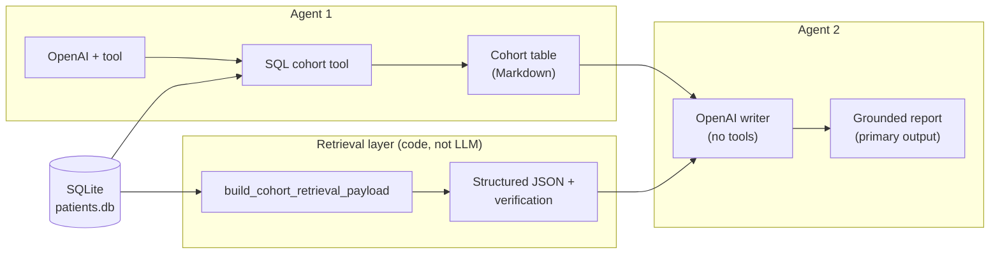

# High-Risk Patient Identifier (HW3)

**Disclaimer.** This project uses **synthetic / educational** SQLite data and **heuristic** quality metrics. Outputs are **not** clinically validated. Do **not** use for diagnosis, treatment, regulatory submissions, or real patient decisions.

---

## Table of contents

1. [What the pipeline actually does](#what-the-pipeline-actually-does)
2. [Agentic loop (two agents + retrieval)](#agentic-loop-two-agents--retrieval)
3. [Shiny app: what you see](#shiny-app-what-you-see)
4. [Quality control: two prompts & metrics](#quality-control-two-prompts--metrics)
5. [Technical details](#technical-details)
6. [Usage](#usage)
7. [Artifacts](#artifacts)
8. [Troubleshooting](#troubleshooting)

---

## What the pipeline actually does

Verified against **`clinical_pipeline.run_full_homework2_pipeline`** (no code changes here—this is documentation only):

| Step | What runs | Notes |
|------|-----------|--------|
| **1. Agent 1** | OpenAI Chat Completions with a **forced tool** | Must call **`list_phq9_elevated_with_safety_concerns`**, which runs SQL on **`patients.db`** for visits with **PHQ-9 > 15** (**≥ 16**) and **`safety_concerns = Y`**. Output is the cohort dataframe. |
| **2. Retrieval (“RAG” context)** | **Deterministic code** — [`retrieval.build_cohort_retrieval_payload`](retrieval.py) | Not an LLM. Builds **`retrieval_payload.json`** (e.g. provider stats, meds, lapsed follow-up) from the DB + cohort patient IDs; writes **verification JSON/MD**. This is the **retrieval-augmented** structured context layered on top of the tool output. |
| **3. Agent 2** | OpenAI **`agent_run`** with **tools disabled** | A single reporting model receives **the same bundled inputs**: cohort table Markdown, retrieval JSON as text, **`clinical_rag_rules.yaml`**, and verification wording. Conceptually **one writer** consumes **Agent 1’s table + retrieval payload**. |

**Evaluation hook:** for each **`trial_id`**, the orchestrator calls **Agent 2 twice in a row**: first filling the **baseline** template ([`qc/prompts/hw2_baseline_prompt.txt`](qc/prompts/hw2_baseline_prompt.txt)), second the **grounded executive** template ([`qc/prompts/hw2_grounded_prompt.txt`](qc/prompts/hw2_grounded_prompt.txt)). Both strings are validated and logged to **`qc_results.csv`**. The **_return value used as the primary report / `report_full` is always the grounded (second) output** (`clinical_pipeline.py` sets `report_full` from **`report_b_latest`**).

---

## Agentic loop (two agents + retrieval)

This diagram matches **how context flows into the grounded clinical narrative** Agent 2 produces. Retrieval is modeled as **RAG-style augmentation**—structured facts fetched and formatted for the writer—not a separate chat model.



Same pipeline call **also** generates the looser baseline report for QC (same Agent 2 model path, alternate prompt template). That comparison layer is **[documented below](#quality-control-two-prompts--metrics)** and does **not** change the conceptual **two-agent** design of the clinical path.

---

## Shiny app: what you see

[`app/app.py`](app/app.py) loads the pipeline once you run analysis and sets **`report_md`** from **`result["report_full"]`**, which is the **grounded** report only—the **clinical summary accordion does not surface the baseline prompt as the main narrative**.

| UI area | Behavior |
|---------|----------|
| **Clinical summary** | Markdown for the **grounded executive** prompt. |
| **Live quality** ([`live_validation_card.py`](app/live_validation_card.py)) | After a run, **validators + weighted score + pass flag** apply to **that grounded text** only (wrong section headings, grounding checks, lightweight panel). |
| **Quality checks accordion** | Shows **paired statistics** once **`out/qc_results.csv`** exists: baseline vs grounded rows from the **same orchestrated run**, including pass rates, Wilson/bootstrap/McNemar summaries when **`qc_summary`** is available (`_qc_dashboard_html`). |

---

## Quality control: two prompts & metrics

This block is **separate** from the product agent diagram above: purpose is **measurement**.

- **Prompt A (baseline)** — qualitative, fewer mandated sections (`hw2_baseline_prompt.txt`).
- **Prompt B (grounded)** — strict counts, headings, disclosures (`hw2_grounded_prompt.txt`).

For each **`trial_id`**, both completions are graded with mode-specific heading lists (`section_headers_for_mode` in [`qc/validators.py`](qc/validators.py)). Results land in **`out/qc_results.csv`** and narratives in **`out/qc_summary.md`** via [`qc/statistical_analysis.py`](qc/statistical_analysis.py) + [`qc/report_generation.py`](qc/report_generation.py).

### Evaluation dimensions (summary)

| Dimension | Measures | Strict pass notes |
|-----------|----------|-------------------|
| Composite numeric alignment | Visit/patient/lapsed/provider coherence vs ground truth | Drives **`validity_score_0_100`** |
| Visit/patient/lapsed fidelity | Labels match deterministic counts | Pass gate expects **1.0** on each |
| Required sections | `## …` headings for that prompt mode | Pass expects **1.0** for grounded mode where applicable |
| Disclosures | Retrieval verification / limits / meds themes | Score components |
| Unsupported numerals / IDs / providers | Heuristic hallucination proxies | Must be **zero** for strict **`passed_absolute_validity`** |

Full weights → **`WEIGHTS`** in [`qc/scoring.py`](qc/scoring.py). Directional hypothesis for experiments: grounded **Prompt B** should score higher against these checks than baseline **Prompt A** for the **same cohort and payload**—depends on **`n_trials`**, seeds, model.

<details>
<summary>Full prompt texts (baseline + grounded)</summary>

See [`qc/prompts/hw2_baseline_prompt.txt`](qc/prompts/hw2_baseline_prompt.txt) and [`qc/prompts/hw2_grounded_prompt.txt`](qc/prompts/hw2_grounded_prompt.txt). Placeholders **`<<<COHORT_TABLE>>>`**, **`<<<RETRIEVAL_JSON>>>`**, **`<<<RULES_BLOCK>>>`**, etc. are filled in [`clinical_pipeline.py`](clinical_pipeline.py).

</details>

---

## Technical details

| Variable | Role |
|----------|------|
| **`OPENAI_API_KEY`** | Required for Agents 1 and 2 (`functions.py`). Repo-root **`.env`** or **`HW2/.env`** via [`dotenv_loader.py`](dotenv_loader.py). |
| **`OPENAI_MODEL`** | Optional model override |
| **`PATIENTS_DB`** | Optional SQLite path override |
| **`HW2_QC_TRIALS`** / **`HW2_QC_TRIALS_APP`** | Repeated paired baseline+grounded batches |

**Deps:** **`requirements.txt`**. Published app: **`PUBLISH_CONNECT.md`**.

### Main modules

| File | Responsibility |
|------|------------------|
| [`clinical_pipeline.py`](clinical_pipeline.py) | Pipeline entry, retrieval I/O, dual report calls + QC aggregation |
| [`functions.py`](functions.py) | `agent` / `agent_run`, OpenAI |
| [`retrieval.py`](retrieval.py) | Cohort-linked retrieval payload + verification helpers |
| [`app/app.py`](app/app.py) | Shiny UX, grounded-first display, QC panels |
| [`app/live_validation_card.py`](app/live_validation_card.py) | Live validators UI for grounded text |
| [`qc/*.py`](qc/) | validators, scoring, stats, summaries, experiments |

---

## Usage

```bash
# repo root
cp .env.example .env    # then set OPENAI_API_KEY

cd HW2
python3.12 -m venv .venv && source .venv/bin/activate
pip install -r requirements.txt

# UI
shiny run app/app.py --reload

# CLI full pipeline (respects HW2_QC_TRIALS env)
python clinical_pipeline.py

# Multi-trial experiment
python qc/run_hw2_qc_experiment.py --n-trials 20

# Re-score saved CSV — no LLM calls
python qc/run_hw2_qc_experiment.py --regrade-existing
# or  python qc/regrade_hw2_qc.py
```

---

## Artifacts

| Path | Meaning |
|------|---------|
| `out/agent1_tool_trace.json` / `agent1_cohort_findings.md` | Agent 1 trace + cohort markdown |
| `out/retrieval_payload.json`, `retrieval_verification.*` | Retrieval + checks |
| `out/prompt_a_baseline_report.md` | Latest baseline QC report |
| `out/prompt_b_grounded_report.md`, `homework2_comprehensive_report.md` | **Primary** grounded report(s) |
| `out/qc_results.csv`, `out/qc_summary.md` | Paired QC metrics & write-up |

**Tool:** **`list_phq9_elevated_with_safety_concerns`** — SQL definition in **[`clinical_pipeline.py`](clinical_pipeline.py)**.

---

## Troubleshooting

| Issue | Hint |
|-------|------|
| Agent 1 missing tool output | Confirm API key & **tool-capable** model (`gpt-4o-mini`, etc.) |
| Empty cohort | Check **`patients.db`** location / schema |
| QC stats noisy | Increase **`--n-trials`** |
| Deploy to Connect | **`PUBLISH_CONNECT.md`** |

**Quick refs:** primary UI report = **`grounded`** (`report_full`) · `python qc/run_hw2_qc_experiment.py --help`
