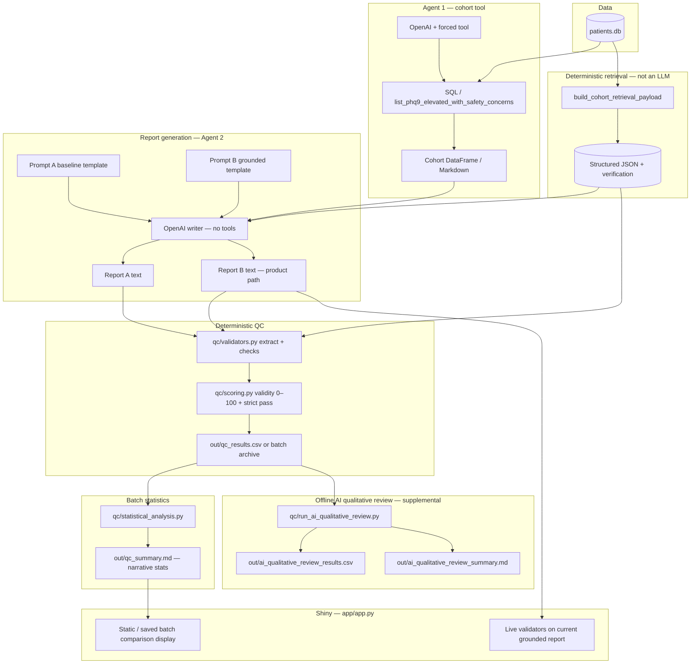

# Quality Control Pipeline — Holistic Overview

This document stitches together **the deterministic 50-trial QC experiment**, **the offline AI qualitative review**, and **how the dashboard uses validation** into one narrative. It aligns with the architectural flow described in [`README_QC_VALIDATION.md`](README_QC_VALIDATION.md) but adds full results, prompts, statistics, and operational detail.

**Disclaimer.** All data are **synthetic / educational**. Automated metrics are **heuristic**. This is **not** clinical, diagnostic, or regulatory validation. Do not use outputs for real patient care.

---

## Table of contents

1. [Executive summary: what we prioritized](#1-executive-summary-what-we-prioritized)
2. [Why Prompt B (grounded) leads the clinical-facing app](#2-why-prompt-b-grounded-leads-the-clinical-facing-app)
3. [End-to-end narrative: what we ran, in order](#3-end-to-end-narrative-what-we-ran-in-order)
4. [System architecture and data flow](#4-system-architecture-and-data-flow)
5. [Validation criteria table](#5-validation-criteria-table)
6. [How this differs from typical “LAB” Likert scales](#6-how-this-differs-from-typical-lab-likert-scales)
7. [Experimental design](#7-experimental-design)
8. [Statistical analysis — deterministic batch (50 paired trials)](#8-statistical-analysis--deterministic-batch-50-paired-trials)
9. [Statistical analysis — offline AI qualitative review](#9-statistical-analysis--offline-ai-qualitative-review)
10. [Interpreting deterministic vs narrative scores together](#10-interpreting-deterministic-vs-narrative-scores-together)
11. [Files and roles](#11-files-and-roles)
12. [Technical details](#12-technical-details)
13. [Usage instructions](#13-usage-instructions)

---

## 1. Executive summary: what we prioritized

For an application framed around **high-risk behavioral health cohort review**, the highest-risk failure mode is **fabricated or misaligned numbers and structure** (wrong visit counts, invented totals, missing disclosures). Therefore we **prioritized clinical / analytic accuracy**—alignment with the **deterministic cohort table and retrieval payload**—over **perceived writing polish**.

- **Primary production report:** **Prompt B — Grounded Executive Report** (`qc/prompts/hw2_grounded_prompt.txt`): strict binding to structured counts, required headings, and verification language.
- **Contrast condition:** **Prompt A — Baseline** (`qc/prompts/hw2_baseline_prompt.txt`): encouraged qualitative prose and **explicitly does not require verbatim numeric binding**.

The **authoritative product-grade QC** for “is this report acceptable as grounded analytics?” is **deterministic validation + weighted validity score + strict pass**, computed in code (`qc/validators.py`, `qc/scoring.py`).  

A **secondary, supplemental** layer runs an **AI reviewer** **offline** on saved report text only (`qc/run_ai_qualitative_review.py`): it scores **narrative** dimensions 1–5 **without** checking numeric truth (by design).

---

## 2. Why Prompt B (grounded) leads the clinical-facing app

| Concern | Prompt A (baseline) | Prompt B (grounded) |
|--------|---------------------|----------------------|
| Numeric binding to cohort + JSON | Encourages approximate / qualitative description | **Hard rule:** counts and stated totals must match table/JSON; forbidden inventions |
| Required structure | Logical headers, flexible | **Exact** section order and labels (e.g., executive lines for visits / patients / lapsed follow-up) |
| Role in app | QC **contrast** prompt only | **`report_full` in pipeline = grounded output**; Shiny shows this as the main summary |
| Deterministic QC outcome (50-run batch) | **0%** strict pass rate (see §8) | **100%** strict pass rate |

**Decision:** Even if a separate **narrative** reviewer might prefer looser prose on occasion, **Prompt B** is the appropriate default for anything described as **cohort-grounded executive reporting**, because it is the variant **engineered to satisfy the structural and numeric fidelity gates** that approximate “clinical analytic safety” in this educational stack.

---

## 3. End-to-end narrative: what we ran, in order

### Phase A — Deterministic paired experiment (50 trials)

1. Fixed **synthetic cohort** from `patients.db` (rule: **PHQ-9 > 15** and **safety_concerns = Y**).
2. **Same** deterministic **retrieval payload** and verification for every trial.
3. For each `trial_id` **0 … 49**, the pipeline generated:
   - **Prompt A** completion → graded → one row in **`out/qc_batches/qc_50trials_20260505T130841Z.csv`** (`mode=baseline`).
   - **Prompt B** completion → graded → one row (`mode=grounded`).
4. **Total rows:** **100** (50 baseline + 50 grounded).
5. **Statistical summary** for the batch is reflected in `out/qc_batches/qc_50trials_20260505T130841Z.md` (same numbers as in §8 below).

### Phase B — Offline AI qualitative review (same 100 reports)

1. **Input:** archived CSV `out/qc_batches/qc_50trials_20260505T130841Z.csv`.
2. **Process:** each `report_text` sent to an OpenAI model with a fixed **narrative-only** reviewer prompt (see `qc/run_ai_qualitative_review.py`); **no numeric verification** in that step.
3. **Outputs:**  
   - `out/ai_qualitative_review_results.csv` (row-level qualitative scores + JSON strengths/weaknesses).  
   - `out/ai_qualitative_review_summary.md` (means, paired tests, bootstrap CIs, correlation with deterministic score).

### Phase C — Application behavior (high level)

- **Live run:** builds **grounded report only** for the dashboard (`run_live_homework2_pipeline`), validates it live; **does not** overwrite batch QC artifacts (see [`README_QC_VALIDATION.md`](README_QC_VALIDATION.md)).

---

## 4. System architecture and data flow

This diagram matches the separation in [`README_QC_VALIDATION.md`](README_QC_VALIDATION.md): **source of truth for deterministic grading** is the **retrieval payload + cohort truth**, not an LLM judgment.



**Reading the diagram**

- **Deterministic path:** cohort + payload → report text → **validators + scoring** → CSV → **Python statistics** (t-tests, McNemar, bootstrap, etc.).
- **AI qualitative path:** reads **already generated** report text; **does not** replace validators; **does not** change prompts or pipeline code when run.

---

## 5. Validation criteria table

### A. Deterministic / structural (primary)

These are implemented in `qc/validators.py` and rolled up in `qc/scoring.py`. **Scale:** most sub-metrics are **rates in [0, 1]**; overall **`validity_score_0_100`** is a **weighted sum** (max 100 before penalty) minus a **capped hallucination-style penalty**. **Strict pass** is a **boolean gate** (see benchmarks below).

| Dimension (representative) | Description (short) | Scale / method | Benchmark / gate (strict pass) |
|----------------------------|---------------------|----------------|--------------------------------|
| Numeric accuracy composite | Blend of visit / patient / lapsed fidelity and provider linkage | Rate **0–1** → contributes **weighted points** (weight **34**) | Part of **`validity ≥ 80`**; visit/patient/lapsed rates must equal **1.0** individually for pass |
| Patient count fidelity | Match of stated vs expected patient count | Rate **0–1** (weight **10**) | **`patient_count_match_rate == 1.0`** for pass |
| Provider visit fidelity | Alignment with retrieval provider visit structure | Rate **0–1** (weight **11**) | Implicit in weighted score under numeric/provider linkage |
| Lapsed follow-up fidelity | Match of lapsed follow-up reporting vs payload | Rate **0–1** (weight **9**) | **`lapsed_followup_match_rate == 1.0`** for pass |
| Required sections | Required `##` headings for **each prompt mode** | Rate **0–1** (weight **12**) | **`required_sections_rate == 1.0`** for pass |
| Retrieval check disclosure | Retriever / verification disclosures | Rate **0–1** (weight **8**) | In weighted score |
| Limitations disclosure | Stated limits of data / method | Rate **0–1** (weight **8**) | In weighted score |
| Medication theme mention | Presence of medication theme signal | Rate **0–1** (weight **8**) | In weighted score |
| Clinically unsupported numerals | Count of numerals that look like unsupported cohort claims | **Integer count**; penalty | **Must be 0** for strict pass |
| Unsupported patient identifiers | Citations not supported by payload | **Integer count**; penalty | **Must be 0** for pass |
| Unsupported provider strings | Provider tokens not supported | **Integer count**; penalty | **Must be 0** for pass |
| **Validity score** | Weighted rollup minus penalty + small concision term | **0–100** | **`≥ 80`** required for pass |
| **Strict pass** | Conservative “ship line” for this homework | **Boolean** | All of: validity ≥ 80, required sections 100%, patient/visit/lapsed match 100%, zero unsupported identifiers/numerals per `scoring.py` |

Weights are defined in **`WEIGHTS`** in [`qc/scoring.py`](qc/scoring.py).

### B. Offline AI qualitative (supplementary)

**Source:** reviewer prompt embedded in **`qc/run_ai_qualitative_review.py`**. Each dimension is scored **1–5** **from report text alone**; the model is instructed **not** to verify numeric correctness.

| Dimension | Description (from reviewer prompt) | Scale | Benchmark |
|-----------|--------------------------------------|-------|-----------|
| Clarity | Organization, readability | **1–5** Likert-style | Descriptive only (no pass/fail) |
| Clinical usefulness | Actionability / insight for a care team | **1–5** | Descriptive |
| Coherence | Logical flow, contradictions | **1–5** | Descriptive |
| Completeness | Coverage of cohort patterns, provider/access, meds/docs, continuity | **1–5** | Descriptive |
| Overall quality | Holistic narrative quality | **1–5** | Descriptive; used vs **`validity_score_0_100`** in correlation table |

Strengths / weaknesses are **lists of strings**; stored as JSON in the results CSV.

---

## 6. How this differs from typical “LAB” Likert scales

**Typical LAB / survey setups** often ask human coders or students to rate outputs on **Likert scales** (e.g., 1–5 agreement with statements like “clear” or “accurate”) **without** an external, machine-checkable **ground truth** for every item.

**This project’s primary QC is different:**

1. **Ground-truth-anchored rates:** Many dimensions are **not** “opinion” — they are **computed against** the cohort table and retrieval JSON (counts, headings, disclosure heuristics).
2. **Single strict gate:** **`passed_absolute_validity`** collapses multiple **hard** requirements into one **audit-style** decision suitable for dashboards.
3. **0–100 validity** is a **weighted engineering score**, not a Likert average across human raters.
4. **The AI reviewer’s 1–5 scales** *are* closer to **Likert-like narrative judgment**, but they are **explicitly secondary** and **explicitly barred** from adjudicating numeric truth (that stays in deterministic validators).

---

## 7. Experimental design

| Element | Specification |
|---------|----------------|
| **Prompts compared** | **Prompt A:** `qc/prompts/hw2_baseline_prompt.txt` (qualitative baseline). **Prompt B:** `qc/prompts/hw2_grounded_prompt.txt` (grounded executive). |
| **Pairing** | Same **`trial_id`**, **same cohort**, **same retrieval payload** → **paired** comparisons. |
| **Trials** | **50** paired trials ⇒ **50** baseline + **50** grounded reports. |
| **Sample size** | **n = 50** paired differences per metric (deterministic validity and pass rate analyses use these pairs). Row-level deterministic output: **100** rows. |
| **Grader for experiment** | **Deterministic codebase** (`validators` + `scoring`), identical rules for both modes aside from **mode-specific required headings**. |
| **Supplement** | Offline **AI qualitative** review on the **same 100** report texts (**separate** model call path). |

---

## 8. Statistical analysis — deterministic batch (50 paired trials)

**Hypotheses (informal, for interpretation).**  
We expect **Prompt B** to produce **higher** deterministic validity scores and **higher** strict pass rates than **Prompt A**, because **B** is constrained to match structured truth.

**Tests and estimands** (implemented in [`qc/statistical_analysis.py`](qc/statistical_analysis.py); narrative in batch markdown).

### 8.1 Outcome summaries (all rows pooled and by mode)

| Quantity | Result (50-trial archived batch / `qc_50trials_*`) |
|---------|-----------------------------------------------------|
| Overall mean **validity_score_0_100** | **71.64** |
| Overall **95% CI** on mean validity (all 100 rows) | **[67.70, 75.58]** |
| Overall **pass rate** (strict) | **50.0%** |
| **Prompt A** mean validity | **51.64** |
| **Prompt A** pass rate + **Wilson 95%** | **0.0%** [ CI **0.0–7.1** ] |
| **Prompt B** mean validity | **91.64** |
| **Prompt B** pass rate + **Wilson 95%** | **100.0%** [ CI **92.9–100.0** ] |
| Structural error rate (reported aggregate) | **0.0%** for both modes in summary file |

### 8.2 Pass-rate comparison (paired binary outcomes)

| Quantity | Result |
|---------|--------|
| Pass-rate **difference** (Prompt B − Prompt A) | **+100.0** percentage points |
| **Bootstrap 95% CI** for that difference | **[100.0, 100.0]** |
| **McNemar** (statsmodels exact) **p-value** | **1.776e−15** |
| Discordant cells | baseline pass / grounded fail = **0**; baseline fail / grounded pass = **50** |
| Narrative conclusion in file | Pass-rate improvement statistically significant |

### 8.3 Continuous paired score comparison (validity 0–100)

| Quantity | Result |
|---------|--------|
| **Paired _t_-statistic** (grounded − baseline, paired by `trial_id`) | **95.37** |
| **Cohen’s _d_** (paired formulation used in codebase) | **19.70** |

**Interpretation note:** Cohen’s **_d_** can be **very large** when paired lifts are **consistent** with **little variance**; it **does not** mean “multiplicatively better in a clinical sense.”

### 8.4 Failure mode aggregation (frequency table across rows)

| Failure mode | Count | Share |
|--------------|------:|------:|
| Did not pass absolute validity | **50** | **50.0%** |
| Visit count fidelity below 1.0 | **50** | **50.0%** |
| Missing required sections | **50** | **50.0%** |
| Unsupported patient identifier citation(s) | **0** | **0.0%** |
| Unsupported provider name signal(s) | **0** | **0.0%** |
| Hallucinated state mention(s) | **0** | **0.0%** |
| Clinically unsupported numeral occurrence(s) | **0** | **0.0%** |
| Patient count fidelity below 1.0 | **0** | **0.0%** |
| Lapsed follow-up count fidelity below 1.0 | **0** | **0.0%** |
| Numeric accuracy below 0.60 | **0** | **0.0%** |
| Confidence label match below 1.0 | **0** | **0.0%** |
| Low/moderate confidence disclosure below 1.0 | **0** | **0.0%** |
| Unsupported structured confidence claim(s) | **0** | **0.0%** |
| Grader stubs (unsupported_claims / confidence_misuse non-empty) | **0** / **0** | **0.0%** |

*(Counts can overlap across flags on the same rows.)*

### 8.5 Confidence-validation block (included in markdown for framework compatibility)

- By-label summary for **neutral** dominance: validity **71.64**, numeric alignment **83.9%**, pass rate **50.0%**.
- **Pearson correlation** between upstream confidence columns and validity: **not computed** (insufficient variation in confidence scores).

**Tests not used here:** Analysis is **paired _t_-test style** statistics and **McNemar**, not multi-group ANOVA or regression, for this batch layer.

---

## 9. Statistical analysis — offline AI qualitative review

**Hypothesis (informal).** Narrative reviewer scores **may diverge** from deterministic validity **because constructs differ** (readability vs grounding).

All numbers below match **`out/ai_qualitative_review_summary.md`** (model **`gpt-4o-mini`**, **n = 50** pairs).

### 9.1 Descriptive means (grounded − baseline)

| Dimension | Baseline mean | Grounded mean | Difference (G − B) |
|-----------|---------------|---------------|---------------------|
| clarity | **4.860** | **3.080** | **−1.780** |
| clinical_usefulness | **4.460** | **3.000** | **−1.460** |
| coherence | **4.940** | **3.380** | **−1.560** |
| completeness | **4.460** | **3.160** | **−1.300** |
| overall_quality | **4.460** | **3.040** | **−1.420** |

### 9.2 Paired inference (paired difference per `trial_id`, two-sided **_t_ on mean difference** vs 0)

| Dimension | n | Mean diff | Paired _t_ | _p_-value | Cohen’s _d_* | Bootstrap 95% CI (mean Δ) |
|-----------|---|-----------|-------------|-----------|---------------|---------------------------|
| clarity | **50** | **−1.780** | **−30.079** | **3.017e−33** | **−4.297** | **[−1.880, −1.660]** |
| clinical_usefulness | **50** | **−1.460** | **−20.506** | **1.078e−25** | **−2.929** | **[−1.600, −1.320]** |
| coherence | **50** | **−1.560** | **−18.040** | **2.788e−23** | **−2.577** | **[−1.720, −1.380]** |
| completeness | **50** | **−1.300** | **−14.212** | **5.231e−19** | **−2.030** | **[−1.480, −1.120]** |
| overall_quality | **50** | **−1.420** | **−18.665** | **6.471e−24** | **−2.667** | **[−1.560, −1.280]** |

\*Cohen’s _d_ for paired differences: **mean(Δ) / SD(Δ)** in script.

### 9.3 Relationship to deterministic QC (same enriched rows)

| Measure | Result |
|---------|--------|
| Pearson **_r_** (`ai_overall_quality` vs `validity_score_0_100`) | **−0.888** |
| Mean **`ai_overall_quality`** \| deterministic **passed** | **3.040** (_n = 50_) |
| Mean **`ai_overall_quality`** \| deterministic **failed** | **4.460** (_n = 50_) |

**Interpretation:** In this dataset, reports that **pass** deterministic strict checks tend to score **lower** on the subjective **overall narrative** Likert-like scale—consistent with **tighter, more templated prose** versus freer baseline narrative.

---

## 10. Interpreting deterministic vs narrative scores together

**Do not contradict the tables.**

- **Deterministic QC:** Prompt B delivers **much higher fidelity**—**100% strict pass vs 0%**—with documented **Wilson intervals**, **McNemar**, and **paired validity lift**.
- **AI qualitative reviewer:** On **all five narrative dimensions**, **baseline mean scores were higher** than grounded (Δ **negative** everywhere); paired tests show **large negative mean differences** with **tight bootstrap intervals**.

**Clinical product stance:**  
**Prioritize Prompt B** for anything described as **grounded, audit-style cohort reporting**. Treat the **offline AI reviewer** as **hypothesis generating** (“how does enforcing structure change perceived readability?”), **not** as a veto over deterministic grounding.

Suggested framing:

> **Tradeoff hypothesis:** richer narrative flow (Prompt A) can read “smoother” to a reviewer that is **explicitly barred from grading numeric truth**, while stricter grounding (Prompt B) **buys deterministic validity at the expense of subjective narrative polish**—a trade acceptable for analytic integrity in this sandbox.

---

## 11. Files and roles

| Path | Purpose |
|------|---------|
| [`patients.db`](patients.db) | Synthetic SQLite visits/patients |
| [`clinical_pipeline.py`](clinical_pipeline.py) | Agent 1 + retrieval + live grounded run path (no batch overwrite in app path) |
| [`retrieval.py`](retrieval.py) | Deterministic cohort payload |
| [`functions.py`](functions.py) | OpenAI client helpers, env loading |
| [`dotenv_loader.py`](dotenv_loader.py) | Loads `.env` from repo root + `HW2/.env` |
| [`qc/validators.py`](qc/validators.py) | All deterministic metrics |
| [`qc/scoring.py`](qc/scoring.py) | `validity_score_0_100` + `passed_absolute_validity` |
| [`qc/statistical_analysis.py`](qc/statistical_analysis.py) | Batch stats: Wilson, bootstrap pass difference, McNemar, paired _t_, Cohen’s _d_, failure modes |
| [`qc/report_generation.py`](qc/report_generation.py) | Writes `qc_summary.md` narratives |
| [`qc/run_hw2_qc_experiment.py`](qc/run_hw2_qc_experiment.py) | Runs `_n` paired trials → writes **`out/qc_results.csv`** + summary + immutable archive under `out/qc_batches/` |
| [`qc/run_ai_qualitative_review.py`](qc/run_ai_qualitative_review.py) | **Offline only:** AI reviewer on existing CSV → `ai_qualitative_review_*` |
| [`qc/prompts/hw2_baseline_prompt.txt`](qc/prompts/hw2_baseline_prompt.txt) | Prompt A template |
| [`qc/prompts/hw2_grounded_prompt.txt`](qc/prompts/hw2_grounded_prompt.txt) | Prompt B template |
| [`app/app.py`](app/app.py) | Shiny UI; live QC on current grounded report |
| [`app/live_validation_card.py`](app/live_validation_card.py) | Live checklist presentation |
| `out/qc_batches/qc_50trials_*.csv` | **Immutable** archived 50-run row-level deterministic results |
| `out/ai_qualitative_review_results.csv` | Row-level AI qualitative scores |
| `out/ai_qualitative_review_summary.md` | AI qualitative statistical write-up |
| [`README.md`](README.md) | Project overview |
| [`README_QC_VALIDATION.md`](README_QC_VALIDATION.md) | Focused QC framework doc (unchanged companion) |
| [`PUBLISH_CONNECT.md`](PUBLISH_CONNECT.md) | Posit Connect deployment notes |

---

## 12. Technical details

| Topic | Detail |
|-------|--------|
| **Python** | See [`.python-version`](.python-version); **3.10–3.12** typical |
| **Key packages** | `pandas`, `numpy`, `openai`, `shiny`, `PyYAML`, `python-dotenv`, `statsmodels` (and **SciPy** transitively for some tests) — see [`requirements.txt`](requirements.txt) |
| **API keys** | **`OPENAI_API_KEY`** required for any LLM step. Optional **`OPENAI_MODEL`**, **`HW2_AI_REVIEWER_MODEL`** for qualitative script. **Never commit** `.env`. |
| **Database** | Default `patients.db` next to `clinical_pipeline.py`; override with **`PATIENTS_DB`** |
| **Batch QC env** | **`HW2_QC_TRIALS`**, optional seeds via experiment script |

---

## 13. Usage instructions

### Install

```bash
cd /path/to/DSAI-HW2/HW2
python3 -m venv .venv
source .venv/bin/activate
pip install -r requirements.txt
```

Create **`.env`** at repo root or **`HW2/.env`** with at least:

```bash
OPENAI_API_KEY=sk-...
# optional:
# OPENAI_MODEL=gpt-4o-mini
# HW2_AI_REVIEWER_MODEL=gpt-4o-mini
```

### Run the Shiny app (dashboard)

```bash
cd /path/to/DSAI-HW2/HW2
source .venv/bin/activate
shiny run app/app.py --reload
```

### Run the **50-trial deterministic batch experiment** (writes `out/qc_results.csv` + summary + archive)

```bash
cd /path/to/DSAI-HW2/HW2
source .venv/bin/activate
python qc/run_hw2_qc_experiment.py --n-trials 50
```

Long run on a laptop (macOS):

```bash
caffeinate -dimsu python qc/run_hw2_qc_experiment.py --n-trials 50
```

### Run the **offline AI qualitative review** on an existing 100-row batch CSV

```bash
cd /path/to/DSAI-HW2/HW2
source .venv/bin/activate

python qc/run_ai_qualitative_review.py \
  --input out/qc_batches/qc_50trials_20260505T130841Z.csv \
  --output out/ai_qualitative_review_results.csv \
  --summary out/ai_qualitative_review_summary.md
```

Resume after interruption (skips rows with **`ai_review_available`** already true):

```bash
python qc/run_ai_qualitative_review.py \
  --input out/qc_batches/qc_50trials_20260505T130841Z.csv \
  --output out/ai_qualitative_review_results.csv \
  --summary out/ai_qualitative_review_summary.md \
  --resume
```

Regenerate **`ai_qualitative_review_summary.md`** from an existing completed results CSV:

```bash
python qc/run_ai_qualitative_review.py \
  ...same arguments... \
  --resume
```

### Where to read results

| Artifact | Content |
|---------|---------|
| `out/qc_batches/qc_50trials_*.md` | Deterministic statistical narrative for that batch |
| `out/qc_batches/qc_50trials_*.csv` | Raw per-report deterministic metrics |
| `out/ai_qualitative_review_summary.md` | **All** qualitative statistical tests |

---

### Cross-reference

For a shorter QC-only checklist and file chart, continue to **`README_QC_VALIDATION.md`**. This document (**`README_QUALITY_CONTROL_PIPELINE.md`**) is the **holistic** narrative with **full statistical tables** and the **clinical-accuracy-vs-narrative** framing.
